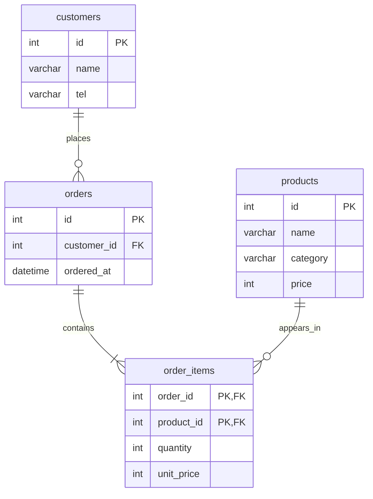

# 쇼핑몰 ERD 설계서

## 1. 엔터티 정의

| 엔터티 | 저장하는 정보 | 기본 키 |
|---|---|---|
| `customers` | 회원의 기본 정보 | `id` |
| `products` | 판매 상품 정보 | `id` |
| `orders` | 회원의 주문 한 건 | `id` |
| `order_items` | 주문에 담긴 상품과 주문 당시 가격 | `(order_id, product_id)` |

## 2. ERD

관계선은 세 개입니다. 주문과 상품의 N:M 관계는 `order_items`를 교차 테이블로 두어 두 개의 1:N 관계로 풀었습니다.

## 3. 관계와 제약

- `customers 1:N orders`: 회원 한 명은 여러 주문을 할 수 있고, 주문 한 건은 한 회원에게 속합니다. `orders.customer_id`가 `customers.id`를 참조합니다.
- `orders 1:N order_items`: 주문 한 건에는 하나 이상의 상품 행이 들어갑니다. `order_items.order_id`가 `orders.id`를 참조합니다.
- `products 1:N order_items`: 상품 하나는 여러 주문의 상품 행에 나타날 수 있습니다. `order_items.product_id`가 `products.id`를 참조합니다.
- `order_items`의 복합 기본 키는 `(order_id, product_id)`입니다. 같은 상품이 한 주문에 중복 행으로 들어가는 것을 막고, 두 값은 각각 외래 키 역할도 합니다.

## 4. 정규화 근거

- 고객의 이름과 전화번호를 `orders`에 반복 저장하지 않고 `customers`로 분리했습니다. 전화번호가 바뀌어도 고객 정보 한 곳만 갱신하면 되어 갱신 이상을 줄입니다.
- 주문 상품을 한 칸에 쉼표로 나열하지 않고 `order_items`의 행으로 저장했습니다. 상품별 수량과 매출을 조회하고 인덱스를 활용할 수 있습니다.

## 5. 반정규화 결정

`order_items.unit_price`에는 주문 당시의 상품 가격을 저장합니다. 이후 `products.price`가 바뀌어도 과거 주문 금액은 보존되어야 합니다. 이 값은 주문 상품 행을 만들 때 복사하고, 주문 확정 뒤에는 갱신하지 않는 규칙으로 관리합니다.

## 6. 외래 키 동작 확인

- 존재하지 않는 `customer_id`로 주문을 넣으면 외래 키 제약에 의해 MySQL 오류 1452가 발생합니다.
- 주문이 남아 있는 고객을 삭제하면 참조 무결성 제약에 의해 MySQL 오류 1451이 발생합니다.

외래 키 기본 동작은 참조 중인 행의 삭제를 막습니다. 실제 테이블의 제약 이름과 설정은 DB에서 `SHOW CREATE TABLE orders;`로 확인할 수 있습니다.